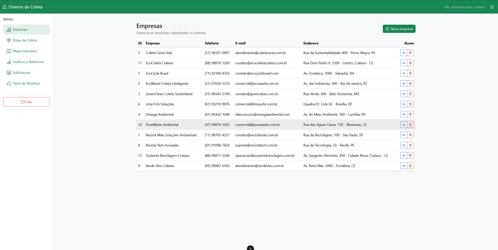
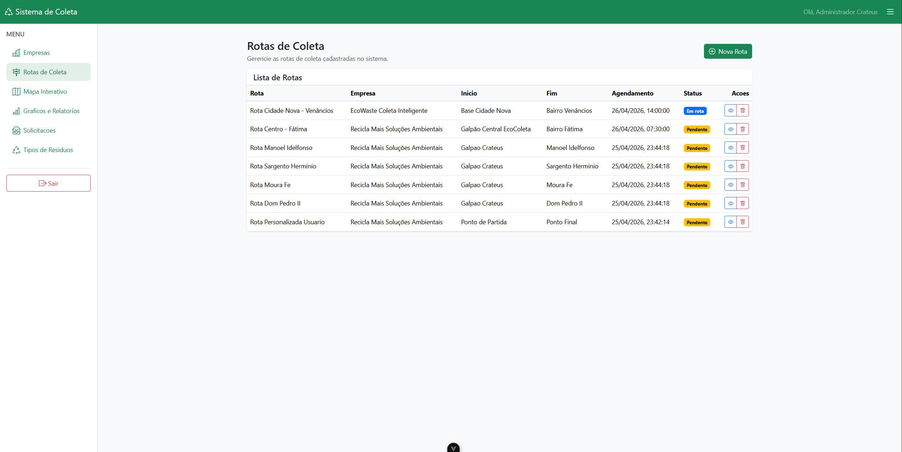
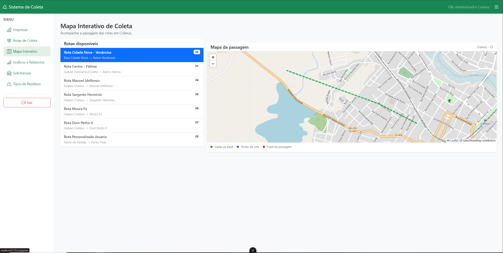
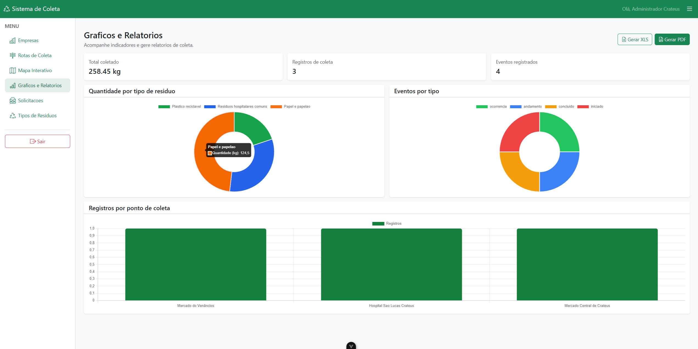
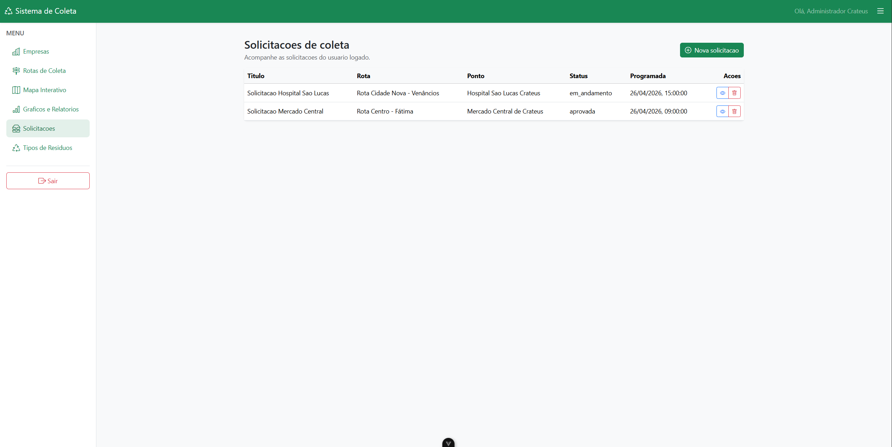
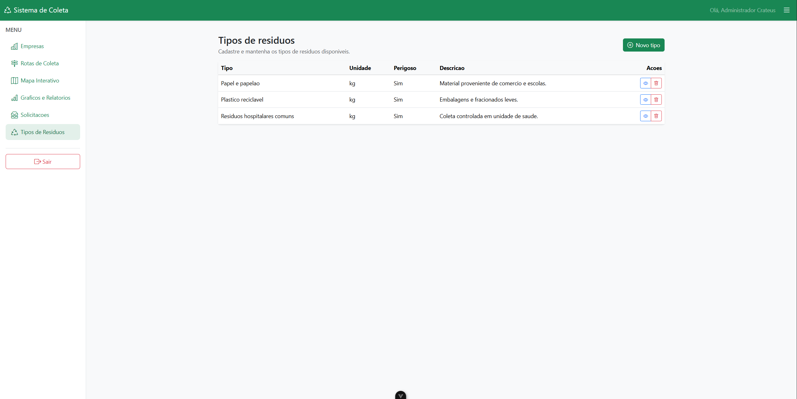

# Sistema de Coleta de Resíduos

Plataforma inteligente para gerenciamento de coleta de resíduos, focada em rastreabilidade, eficiência logística e sustentabilidade urbana. ♻️


## 📋 Sumário

- [Objetivo](#-objetivo)
- [Demonstração Visual (Slides)](#-demonstração-visual-slides)
- [Funcionalidades Principais](#-funcionalidades-principais)
- [Arquitetura da Solução](#-arquitetura-da-solução)
- [Stack Tecnológica](#-stack-tecnológica)
- [Estrutura do Repositório](#-estrutura-do-repositório)
- [Guia de Instalação](#-guia-de-instalação)
- [Boas Práticas](#-boas-práticas-e-padrões)

---

## 🎯 Objetivo

O **Sistema de Coleta** centraliza todo o fluxo operacional de gestão de resíduos em uma aplicação web moderna e resiliente. O projeto visa:

- **Otimização Logística:** Planejamento inteligente de rotas e pontos de coleta. 🚚
- **Rastreabilidade:** Acompanhamento em tempo real da execução das coletas. 📍
- **Gestão de Dados:** Dashboards detalhados para auditoria e métricas de sustentabilidade. 📊
- **Compliance:** Controle rigoroso de empresas, tipos de resíduos e permissões de acesso. 🏢

---

## 📸 Demonstração do Sistema

Abaixo você pode conferir as principais telas e funcionalidades da plataforma em operação.

---

### 1. Gestão de Empresas

*Painel administrativo para controle de empresas parceiras e prestadoras de serviço.*

---

### 2. Planejamento de Rotas

*Interface de controle e visualização de rotas agendadas e status de execução.*

---

### 3. Monitoramento via Mapa Interativo

*Acompanhamento geoespacial (Leaflet) da passagem das rotas e pontos de coleta.*

---

### 4. Inteligência de Dados (Analytics)

*Gráficos dinâmicos (Chart.js) e relatórios para análise de volume e tipos de resíduos.*

---

### 5. Fluxo de Solicitações

*Gerenciamento de ordens de serviço e solicitações de coleta sob demanda.*

---

### 6. Catálogo de Resíduos

*Configuração personalizada de tipos de materiais e regras de coleta.*

---

---

## 🚀 Funcionalidades Principais

### Módulos de Negócio
- **Cadastros:** Gestão de empresas, usuários, pontos estratégicos e tipos de resíduos.
- **Operação:** Abertura de ordens, distribuição de rotas e atualizações de status em tempo real.
- **Monitoramento:** Painel de controle para coletas pendentes, em rota e concluídas.
- **Relatórios:** Exportação e visualização consolidada por período, volume e material.

### Perfis de Acesso
- **Administrador:** Gestão global de regras, usuários e configurações do sistema.
- **Operador:** Criação, agendamento e acompanhamento de coletas.
- **Coletor:** Atualização de status e registro de execução diretamente no campo.
- **Gestor:** Visualização de KPIs, indicadores de produtividade e impacto ambiental.

---

## 🏗️ Arquitetura da Solução

O projeto foi construído seguindo os princípios da **Clean Architecture**, garantindo um sistema altamente testável, desacoplado e de fácil evolução.

### Divisão de Camadas
- **Presentation:** 
  - Backend: Controllers CodeIgniter 4 (API REST).
  - Frontend: Componentes Vue 3 e State Management com Pinia.
- **Application:** Casos de Uso (Use Cases) e DTOs que orquestram a lógica de negócio.
- **Domain:** Entidades ricas e interfaces (contratos), independentes de frameworks externos.
- **Infrastructure:** Implementações de Repositórios, Modelos, Migrations e integrações de terceiros.

---

## 🛠️ Stack Tecnológica

### Backend
- **PHP 8.2+** & **CodeIgniter 4.7+**
- **PestPHP 3** (Framework de testes BDD moderno)
- **Mockery** (Simulação de objetos para testes unitários)
- **Composer** (Gerenciador de dependências)

### Frontend
- **Node.js 20+** & **Vue.js 3** (Composition API)
- **Vite** (Build tool ultra-rápida)
- **Vitest** (Testes unitários e de integração)
- **Cypress** (Testes E2E e Audits de Performance)
- **Pinia** (Gerenciamento de estado global)

### Suporte e Dados
- **MySQL / MariaDB**
- **Leaflet** (Mapas e Geoprocessamento)
- **Chart.js** (Visualização de dados)

---

## 📂 Estrutura do Repositório

```text
sistema_de_coleta/
  api/                  # Backend em PHP (CodeIgniter 4)
    app/
      Application/      # Camada de Orquestração
      Domain/           # Core do Negócio (Independente)
      Infrastructure/   # Persistência e Integrações
      Controllers/      # Entry-points da API
    tests/              # Suíte de testes com Pest
  frontend/             # Frontend SPA (Vue 3)
    src/
      Domain/           # Lógica de negócio pura
      Data/             # Comunicação com API e Repositórios
      views/            # Páginas da aplicação
      components/       # Componentes reutilizáveis
    cypress/            # Testes de ponta a ponta
  img_sistema/          # Assets de demonstração visual
```

---

## ⚙️ Guia de Instalação

### 1. Configuração da API
```bash
cd api
composer install
cp env .env           # Configure suas credenciais de banco no .env
php spark migrate
php spark serve
```
*API local:* `http://localhost:8080`

### 2. Configuração do Frontend
```bash
cd frontend
npm install
npm run dev
```
*Frontend local:* `http://localhost:5173`

---

## 💎 Boas Práticas e Padrões

- **SOLID & DRY:** Código modularizado para máxima reutilização.
- **BDD (Behavior Driven Development):** Testes que descrevem o comportamento real do usuário.
- **Clean Code:** Nomenclatura semântica e funções de responsabilidade única.
- **Automated QA:** Cobertura robusta com Pest, Vitest e Cypress.

---

Tecnologia e operação integradas para cidades mais limpas, eficientes e sustentáveis. 🌱
